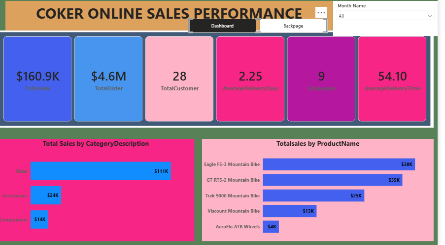
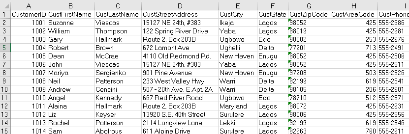

# Coker Online Sales Performance 
## Analyzing sales performance for a period of six months to eliminate wastage and to optimize human and capital resources to generate revenue and sustain the business.

## Executive Summary
- Management requires this data-driven insight to effectively evaluate overall business performance. The analysis provides visibility into key performance indicators, including customer patronage trends, staff productivity measured by the number of customers served per employee, and revenue generation in relation to customer order volumes. These insights enable leadership to assess operational efficiency, identify performance gaps, and make informed strategic decisions to drive growth and improve service delivery.
- Developed an interactive Power BI dashboard to track key performance indicators (KPIs), loyal customers, total orders, and average delivery time across the period under review, enabling data-driven performance monitoring and decision-making.
- The analysis revealed a significant gap between total orders and realized sales. While total orders exceeded $4 million, actual sales amounted to only $160,000, highlighting substantial revenue leakage and a major loss opportunity for the business.
  
## The Business Problem
A comprehensive, data-driven view is required to clearly assess business performance, with specific focus on the relationship between sales realized and total order requests during the period under review.
### Key Question Addressed:
- Change in Key Performance Indicators with the period under review.
- Which product categories and regions are leading?

## The Process (Methodology)
### Tools Used:
Power BI, Power Query, DAX
### Data Sourcing & Overview
The dataset consists of different spreadsheets which have different information about different entities ranging from products, customers,employees, categories, order details and so on.
### Data Cleaning & Transformation 
Using Power Query, the raw data was transformed to ensure accuracy:
- Removed duplicate entries from the dataset.
- Removal of null rows from the dataset.
- Use merge queries to join different columns from two different tables together.
- Create a separate datetable for data modelling to be possible which aids slicing.
- Also, created a new column where necessary.

  

  ## Analysis & Insights
This section breaks down every visualization into actionable insight.
### Breakdown of Total Sales and Total order
- For the period under review, the business realised a total sales of over $160,000 only which is very far from the total order received from customers which stands at $4.6M .
- The analysis also shows that the business has twenty-eight legitimate customers who  are responsible for the total order received from where the business was able to achieve a minimal sales of $160,000+ .
- The business has an average delivery time of 54hrs( over two days).
  ### Breakdown of sales by category description
Bikes recorded the highest sales during the period under review, significantly outperforming other categories. This was followed by accessories, which generated over $24k in sales, while components ranked third with total sales exceeding $14k.
### Breakdown of sales by product name
Most products sold within this category were bikes. The Eagles FS-3 Mountain Bike recorded the highest sales at $38k, followed by the GT RTS-2 Mountain Bike at $35k, while the Trek 9000 Mountain Bike ranked third with $25k in sales. In contrast, the AeroFlo ATB Wheels recorded the lowest sales on the visual, totaling $4k.
###  Customer Behavior & Demographics
Liz, Manuela, and Dean emerged as the top three customers, recording the highest order values of $262k, $259k, and $248k respectively. Geographically, the business received its largest orders from Lagos ($2.11M), Delta ($1.21M), and Enugu ($1.09M). These results were driven by strong sales execution, with Kathryn, Susan, and Carol recognized as the top-performing sales employees during the period under review.

## Recommendation
- Reduce delivery time to improve customer satisfaction and retain long-term customer loyalty.
- Increase investment in bikes, as they are the most ordered product category, to drive higher sales volume and overall revenue.
- Establish smaller business locations or distribution hubs in states with high order volumes to enhance delivery efficiency and significantly reduce lead time.
- Motivate high-performing employees through incentives and recognition, while supporting low-performing employees with clear performance targets and coaching to improve productivity.
- Reward top customers with loyalty programs or exclusive benefits to strengthen retention and encourage repeat purchases.
- Proactively inform customers about plans to open new locations, reinforcing the company’s commitment to faster delivery and improved service quality.

[Coker PowerBI Link](https://app.powerbi.com/view?r=eyJrIjoiNGYxMjc0MDEtZjQ0YS00Y2MzLTk2MGMtZWU3ZmMxYWI1NmU3IiwidCI6IjY0M2NkODIwLWU2YzYtNGI2ZC05ZDc5LTJjOTgwOTllMTg3MCJ9)

  

